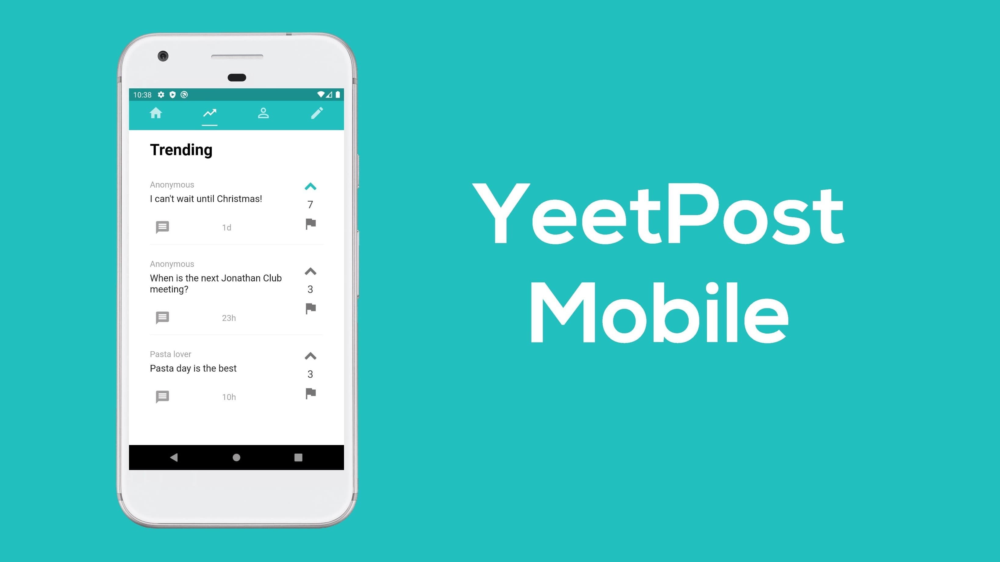

 

# YeetPost-Mobile
YeetPost is an iOS and Android messaging application. Users create location-based posts, called yeets. Unlike most social media and messaging apps, Yeetpost implements a cyberbullying detection algorithm that removes offensive yeets and replies using machine learning.

# Installation
* [Flutter installtion guide](https://flutter.dev/docs/get-started/install)
* [Set-up Firebase](https://firebase.google.com/docs/flutter/setup?platform=android) and add the config file (google-services.json) to android/app/

# Built With
* [Flutter](https://flutter.dev/)
* [Firebase](https://firebase.google.com/)
* [TensorFlow Lite](https://www.tensorflow.org/lite)
